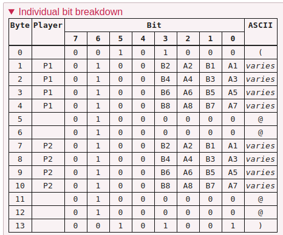
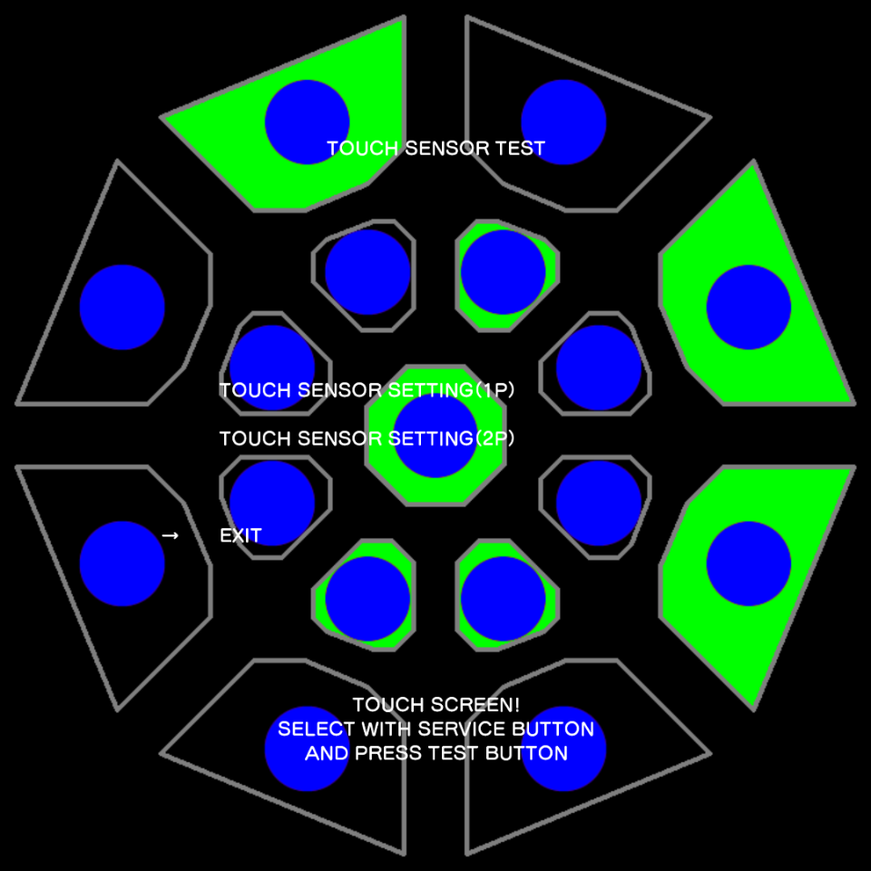

[Contents](/eamuse/sega/) [Intro](/eamuse/sega/intro/) [Software](/eamuse/sega/software/) [Hardware](/eamuse/sega/hardware/) [Manual](/eamuse/sega/manual/)

The MaiMai Touchscreen
======================

The touchscreen for MaiMai, pre-DX, is powered by a Serial I/F BD Touchpanel GunzeASSY IDSEGA 838-15221DescriptionThe interface board for the touchscreen on MaiMai versions pre-DX. board, connected to `COM3`.

Unlike other IO boards, this board communicates using a custom, text-based, protocol.

Serial configuartion
--------------------

|Port|COM3|
|-|-|
|Baud rate|9600|
|Bits per byte|8|
|Stop bits|0|
|Parity bits|0|

Packet format
-------------

As previously mentioned, all packets are text. This means, for the most part, values will stay within a normal printable range. More importantly, null bytes are not permitted as they will be interpted as the end of the string.

Packets sent from the game to the board are surrounded in braces, `{like this}`. Packets sent from the board to the game are surrounded in parentheses, `(like this)`.

### `{HALT}`

| | | | | | |
|-|-|-|-|-|-|
|`{`|`H`|`A`|`L`|`T`|`}`|

This instructs the board to stop sending the state of the touchscreen. No response is expected.

### `{STAT}`

| | | | | | |
|-|-|-|-|-|-|
|`{`|`S`|`T`|`A`|`T`|`}`|

This instructs the board to begin sending the state of the touchscreen (detailed below). No response is expected.

### `{??th}`

| | | | | | |
|-|-|-|-|-|-|
|`{`|`L`/`R`|sensor|`t`|`h`|`}`|

This requests the configured threshold value for a specific sensor from the board. The expected response is as follows:

| | | | | | |
|-|-|-|-|-|-|
|`(`|`L`/`R`|sensor||threshold value|`)`|

### `{??k?}`

| | | | | | |
|-|-|-|-|-|-|
|`{`|`L`/`R`|sensor|`k`|threshold|`}`|

This configures the threshold value for a specific sensor. The expected response is as follows:

| | | | | | |
|-|-|-|-|-|-|
|`(`|`L`/`R`|sensor|||`)`|

Active mode
-----------

After a `{STAT}` packet is received, the board enters a mode where it begins constantly transmitting the state of the touchscreen. The data sent is in the following format:

| | | | |
|-|-|-|-|
|`(`||||
|P1: A1,B1,A2,B2,x|P1: A3,B3,A4,B4,x|P1: A5,B5,A6,B6,x|P1: A7,B7,A8,B8,C|
|padding|padding|||
|P2: A1,B1,A2,B2,x|P2: A3,B3,A4,B4,x|P2: A5,B5,A6,B6,x|P2: A7,B7,A8,B8,C|
|padding|padding|||
|`)`||||

Each data byte is a bit mask of the 5 values it contains, mapped to `1h`, `2h`, `4h`, `8h`, and `10h` respectively. While sending `1fh` would be a valid byte, it is recommended to make use of the upper bits to keep the value within a printable range. I personally recommend masking with `40h` (`'@'`) for this purpose. Values will then range from `@` to `_`. Bits indicated with `x` are unused. It is recommended, but not required, to leave them unset.

The four bytes marked as padding are unused, with the only requirement being that they are non-null. It is recommended, but not required, to set them to `40h` (`'@'`).

**Individual bit breakdown**

An example may aid here. The following image is what transmitting `(FIBT@@@@@@@@)` is interpreted as:

[Previous page](/eamuse/sega/hardware/jvs.html)[sega](/eamuse/sega/)/[hardware](/eamuse/sega/hardware/)/touch.html
