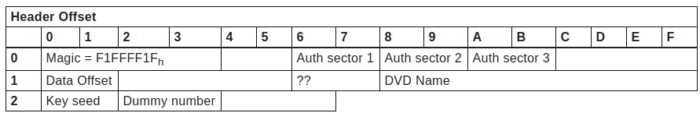
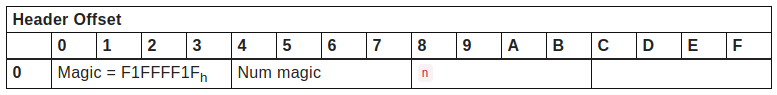

[Contents](/eamuse/sega/) [Intro](/eamuse/sega/intro/) [Software](/eamuse/sega/software/) [Hardware](/eamuse/sega/hardware/) [Manual](/eamuse/sega/manual/)

AlphaDVD (aka αDVD)
===================

αDVD is the custom copy-protection SEGA employ for update DVDs. It is handled by `mxAuthDisc.exe` on Ring systems. Is is present on DVR-\* discs, typically the first in a multi-DVD install process.

In order to understand αDVD, it's important to first have a basic understanding of how data is stored on a DVD. Rather than like random access storage, where the data stream can be moddeled as a large addressable series of bytes, DVDs are more akin to HDDs in their division into sectors. Unlike HDDs, however, there is no prescribed order for the sectors! Each sector of data on disc is prefixed by a header identifying that sector, and notably including its sector number. When a DVD reader is asked to read a specific sector, it spins the disc until it reads the appropriate header, then returns the data following that header. There is importantly nothing here that would stop a disc from containing multiple sectors with the same sector number in their prefix!

DVD readers will return the first sector that matches the requested sector number, so if we know where the different duplicates are on disc we can seek to a known sector a short distance before the instance of the duplicate we wish to aquire, then ask the DVD reader to read the duplicated sector. Depending on where we first seek, we will receive different data back.

αDVD utilises this, with 6 duplicated sectors, each with three distinct copies. When authenticating a disc, only one of these 6 duplicates will be checked, however which is checked is random, so in practice all 6 should be present lest the disc sporadically fails the authentication. This is similar to a copy-protection scheme called TAGES, however more advanced. All three instances **must** be present, so it is impossible to create a single flat image that passes authentication!

As well as this more hardware based authentication, there is a level of encryption applied to the disc headers too. This is however much easeier to work with. Each disc has a header in sector 16, sector 1, or sector 17 (checked in that order). There is no indication which sector contains the header, so in turn each sector is read and decryption is attempted. We can then validate the header magic number.

αDVD Encryption
---------------

αDVD encryption is a basic XOR cipher, where the text is XORed with a key, repeating the key as needed. The key is always 32768 (8000h) bytes, and is unmodified during this process.

Keys are derrived based on a key expansion algorithm that takes as input an unsigned short (16 bit) seed. This algorithm is fundamentally an LSFR-based PRNG, used to generate a stream of bytes, which becomes the key. The `& 0xffffffff` is not strictly necessary but is convenient in python in order to avoid `seed` blowing up in size.

def amAuthDiskInitKey(seed):
    key \= bytearray(0x8000)

    seed <<= 1
    for i in range(len(key)):
        x \= seed

        for \_ in range(8):
            x |= ((((seed \>> 4) ^ x) \>> 11) & 1)
            seed <<= 1
            x <<= 1
        key\[i\] \= (x \>> 1) & 0xff

        seed \= x & 0xffffffff

    return key

αDVD Headers
------------

Now that we know how to decrypt data on αDVDs we can search for the header. The header will always be encrypted with a fixed key with seed `5369`. The header is a sequence of 53 bytes, located at offset 318 if it is in sector 16, and offset 508 if it is in sector 1 or 17.

To validate the decryption of a header, both the magic number and the DVD name are checked. The DVD name must start with `SEGA_DVD`.

The key seed present is the header is used to generate a new key that will be used to decrypt the authentication sectors.

The Authentication Sectors
--------------------------

The three sector addresses in the header are now used to perform a series of seeks and reads. We seek the drive by requesting a read of 16 sectors, but disregarding the returned data. The first step is to choose the authentication sector we wish to read. The six duplicates are present using the following offsets:

*   140h
*   150h
*   160h
*   170h
*   180h
*   190h

We will refer to our chosen offset, from this list, as `n`.

*   Seek to `[Auth sector 1] - 16`
*   Read(16) `([Auth sector 1] + (n - 1)) & 0xFFFFFFF0`
*   Seek to `[Auth sector 1] - 16`
*   Seek to `[Auth sector 1] + [Auth sector 2] - 8`
*   Read(16) `([Auth sector 1] + (n - 1)) & 0xFFFFFFF0`
*   Seek to `[Auth sector 1] + [Auth sector 3] + 8`
*   Read(16) `([Auth sector 1] + (n - 1)) & 0xFFFFFFF0`

Each of the three reads are decrypted using the key we generated earlier, and are authentication block 1, 2, and 3 respectively. The actual data is at offset 31228 in these 16-sector blocks, and follows the following structure:

Num magic will be F1FFFF1Fh in the first sector, F2FFFF2Fh in the second, and F3FFFF3Fh in the third.

There is, however, one extra curveball. One of these three sectors is a dummy sector that contains nonsensiacal data (in practice this appears to just be nulls). This is the sector indicated by the lower byte of the `Dummy number` field in the alpha header. It is essential that this header is **not** valid.

Assuming we pass these checks, αDVD authentication succeeded. The disc will now be be read as usual, applying the data offset from the alpha header before any operations. Coindidentally if an ISO image has been made of an alphaDVD (which will be unable to pass authentication anyway), all sectors preceeding this offset can be stripped, and the ISO now matches that of a non-alpha disc.

[sega](/eamuse/sega/)/[software](/eamuse/sega/software/)/[security](/eamuse/sega/software/security/)/alphadvd.html
